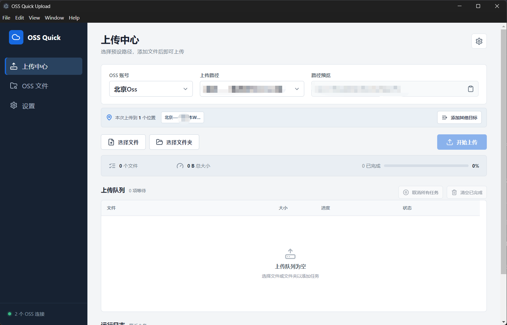
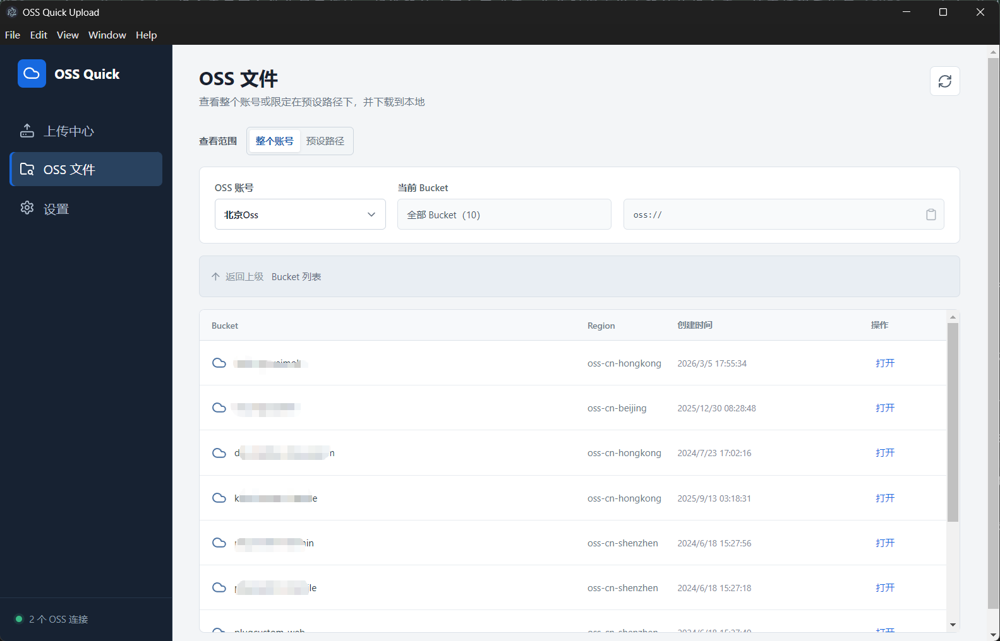
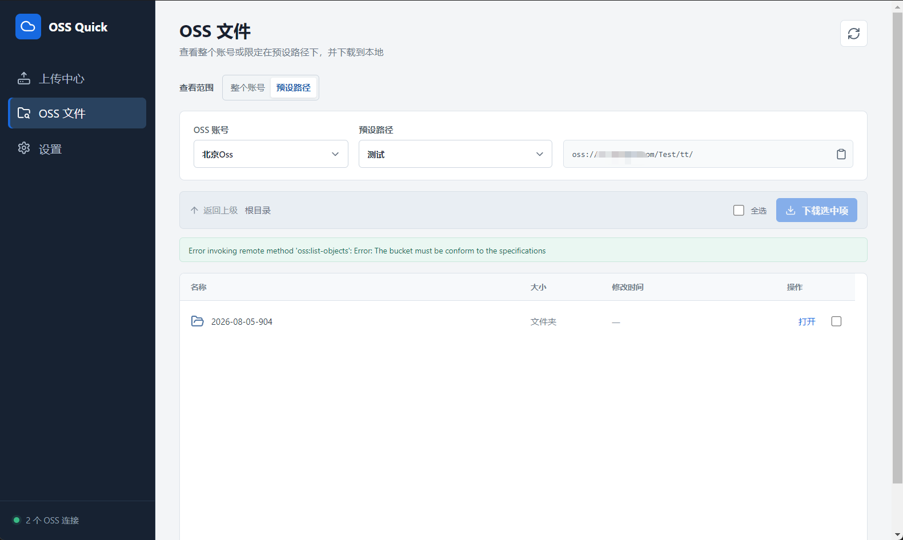
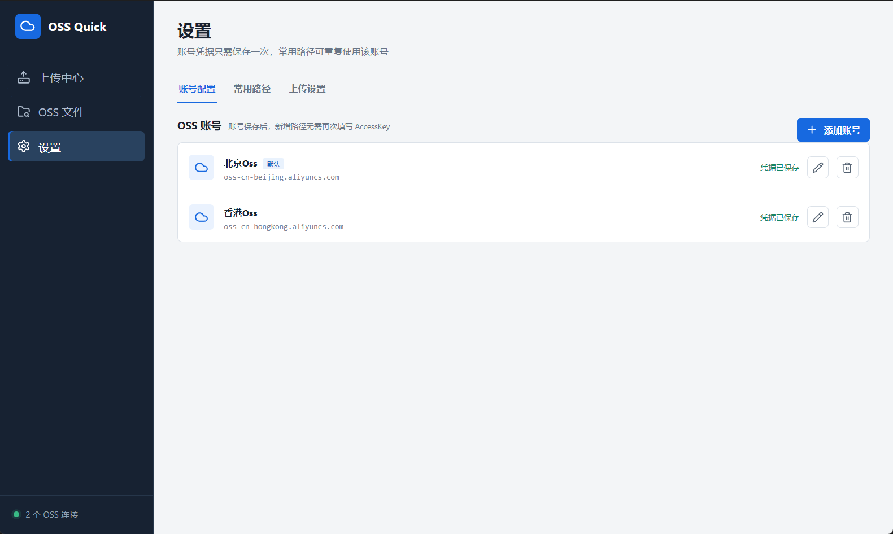
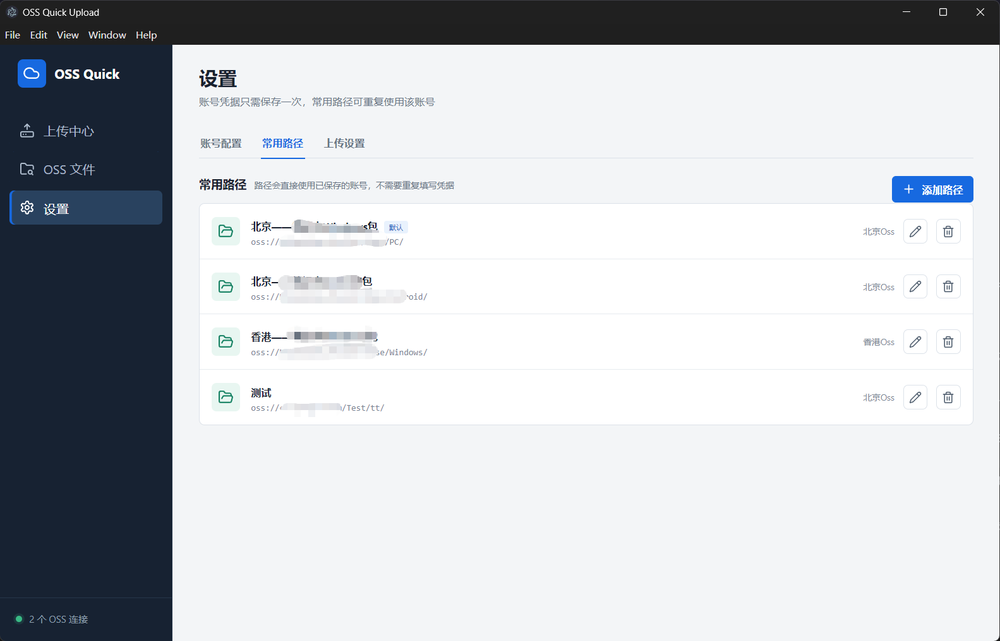
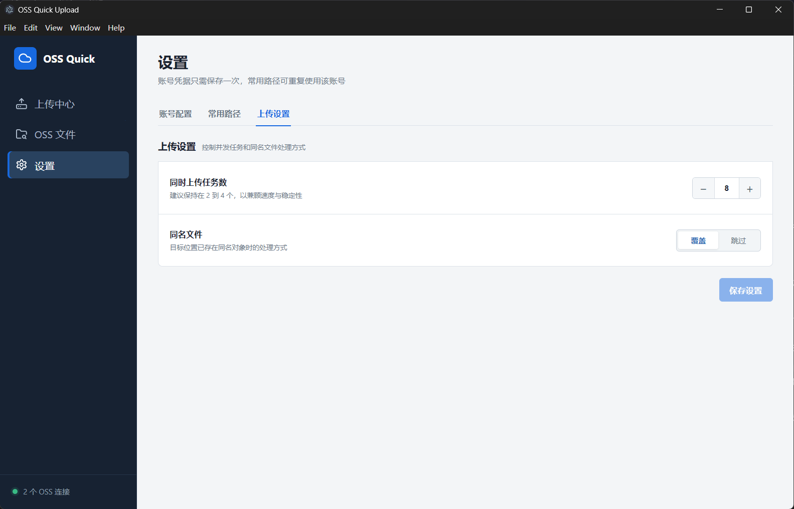

# OSS Quick Upload

<p align="center">
  
</p>

<table>
  <tr>
    <td width="50%" align="center"><br><sub>浏览整个 OSS 账号</sub></td>
    <td width="50%" align="center"><br><sub>浏览预设 OSS 路径</sub></td>
  </tr>
  <tr>
    <td width="50%" align="center"><br><sub>OSS 账号配置</sub></td>
    <td width="50%" align="center"><br><sub>常用路径配置</sub></td>
  </tr>
  <tr>
    <td width="50%" align="center"><br><sub>上传设置</sub></td>
    <td width="50%"></td>
  </tr>
</table>

OSS Quick Upload 是一款面向阿里云 OSS 的 Windows 桌面客户端。它将常用 Bucket 和目录保存为预设路径，上传时只需选择 OSS 账号和目标路径，不必反复查找或输入完整目录。

项目同时提供 OSS 文件浏览与下载能力，可按整个账号或预设路径查看内容，适合软件发布、构建产物归档、资源同步和日常文件管理。

## 主要功能

- 多 OSS 账号管理，账号凭据只需配置一次。
- 为不同账号创建任意数量的常用路径，并添加用途备注。
- 上传前直接选择账号和预设路径，支持一键复制完整 OSS 地址。
- 同一批文件可同时上传到多个 OSS 路径。
- 支持选择文件或整个文件夹，保留文件夹相对目录结构。
- 独立上传队列展示进度、状态和失败原因。
- 支持取消全部任务、清空已完成任务及手动重试失败任务。
- 上传结束后在运行日志中输出成功、跳过和失败汇总。
- 可配置并发上传任务数，以及同名文件覆盖或跳过策略。
- OSS 文件支持“整个账号”和“预设路径”两种查看模式。
- 支持跨 Region 浏览 Bucket，并复制当前 OSS 路径。
- 支持下载单个文件、多个文件或完整文件夹，递归保留目录结构。

## 使用流程

1. 在“设置 > 账号配置”中添加 OSS 账号，填写 Endpoint、Region、AccessKey ID 和 AccessKey Secret。
2. 在“设置 > 常用路径”中选择账号，配置 Bucket、目录前缀、路径名称和备注。
3. 返回“上传中心”，选择 OSS 账号和一个或多个上传路径。
4. 添加文件或文件夹，确认队列后开始上传。
5. 在“OSS 文件”中按账号或预设路径浏览内容，并下载需要的文件或文件夹。

## 凭据安全

AccessKey Secret 不会以明文写入配置文件。应用使用 Electron `safeStorage` 调用操作系统提供的加密能力保存凭据；界面读取配置时只返回凭据是否已保存，不会返回 Secret 原文。

仍建议为本工具创建遵循最小权限原则的 RAM 用户，只授予实际需要访问的 Bucket 和操作权限。

## 开发环境

- Windows 10/11
- Node.js 20 或更高版本
- npm

安装依赖并启动开发环境：

```powershell
npm install
npm run dev
```

执行类型检查：

```powershell
npm run typecheck
```

生成生产构建：

```powershell
npm run build
```

## Windows 打包

双击项目根目录下的 `build.bat`，或在终端执行：

```powershell
build.bat --no-pause
```

脚本会自动安装依赖、执行类型检查和生产构建，并在 `release` 目录生成：

- `OSS Quick Upload Setup 0.1.0.exe`：Windows 安装程序。
- `OSS Quick Upload 0.1.0.exe`：免安装便携程序。

## 技术栈

- Electron
- React
- TypeScript
- electron-vite / Vite
- ali-oss
- lucide-react
- electron-builder

## 项目结构

```text
OssUpload/
|-- src/
|   |-- main/              # Electron 主进程、OSS 请求及本地文件处理
|   |-- preload/           # 安全的渲染进程 IPC 桥接
|   |-- renderer/          # React 用户界面
|   `-- shared/            # 主进程与渲染进程共享类型
|-- pic/                   # 项目截图
|-- build.bat              # Windows 一键打包脚本
|-- electron.vite.config.ts
|-- package.json
`-- README.md
```

## 常用命令

| 命令 | 说明 |
| --- | --- |
| `npm run dev` | 启动 Electron 开发环境 |
| `npm run typecheck` | 执行 TypeScript 类型检查 |
| `npm run build` | 生成主进程、预加载和渲染进程构建 |
| `npm run dist` | 生成 Windows 安装版和便携版 |
| `build.bat --no-pause` | 执行完整 Windows 打包流程 |
